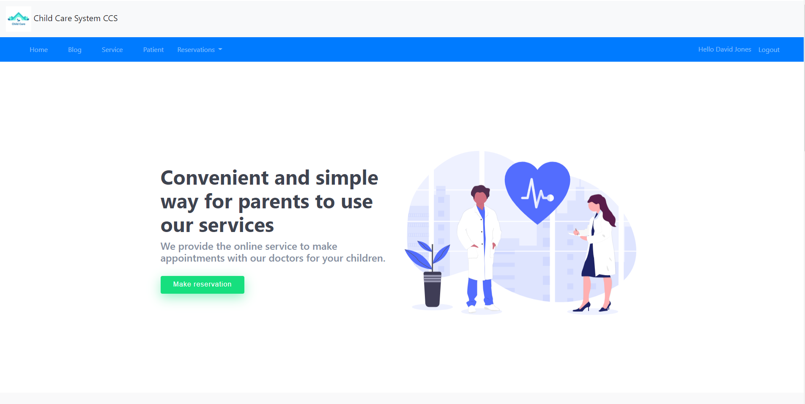
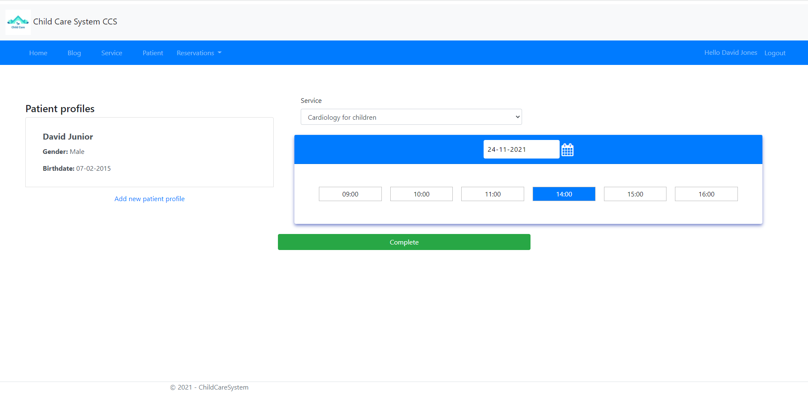
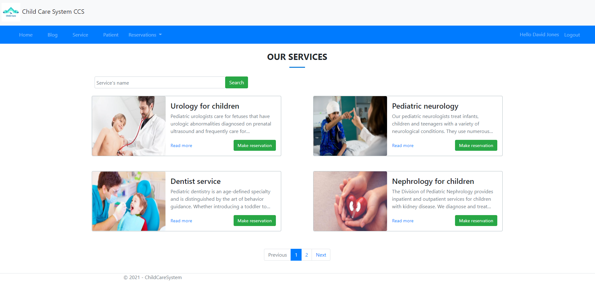
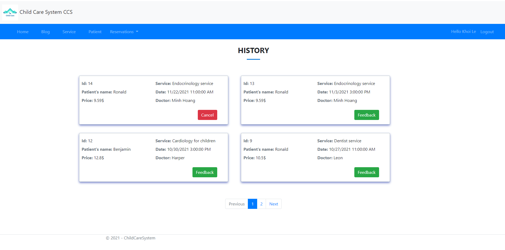

#  Child Care System

## [Live Demo](https://childcaresystem.azurewebsites.net/)

## My web app
- Save time for parents to get our services by making reservations online.
- No need to line up and wait at local health care center.
- Parents can give online feedback for our services.
- View more about our services and blogs.
- Doctors can use to view their schedule and reservation information as well as customer's feedback.
- Admin can manage all website (blogs, services, accounts, patients, reservations)

## Technology
- Front-end: HTML, CSS, Javascript, Bootstrap
- Back-end: .NET Core, Entity Framework, MS SQL
- Deploy on Azure

## Some preview images
&nbsp;
&nbsp;
